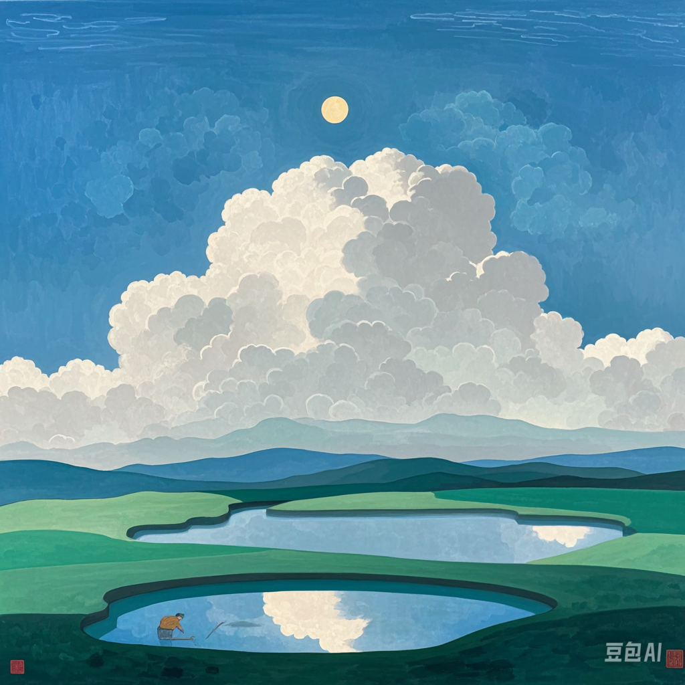

<!-- # categories: [MM]
# tags: [MM]
# image: "imgs/2024-06-30-mm1.png"
# permalink: /2024/07/mm/ -->

#### 题记

问题仍然存在，并没有得到解决。从东倒西歪的课桌，空荡荡的走廊，到毫无症状的教室，随处可见的水杯，坐在座位上的，低下头的，转过身说话的，从教室外回来的，看不见脸的同学，都没有得到解释。一切都停留在那个时间点里，问题并没有得到解决。

似曾相识的感觉总能重新浮现，好比在夜晚从车站下车，沿着路线散步回去，在某个路口，看到一辆车，车窗里，有一个人，穿着白色的衣服，戴着红色的帽子，好像在和我打招呼，我回头，却什么都没有看到，仿佛什么都没有发生过。

就是这样了吧，就是这样了吧，还有什么可说的呢。小孩子觉得的，想象中的，那浩瀚巨大的人生，如今变得狭窄了，狭窄到连一个名字都叫不上来。总是能回到这样的世界里，问题又重新浮现，和那个似曾相识的中午一样，那时候阳光很好，我坐在教室里，被校园广播里的音乐渐渐唤醒，就是那一个瞬间，潮水般的，素不相识的回忆涌入了我的脑海中。一切停留在那个瞬间，如果说什么东西死了的话，死了就死了吧。

 

十年，这是中学生无法想象的时间尺度，但是已经过去太久太久了。已经无法接受了，无法接受了吗。小孩子的时间，与其说社会是一个草台班子，不如说社会是一个由“大孩子”们自己管理的大学校。在这个学校里，人们都是大孩子，一切都在太阳底下，能碰到的事都是“大学校”里的事，也就毫不稀奇了。

## 正文

言归正传，人总归是长大了，其实能做的不多。能怎么为国家做贡献呢，不给国家添乱，正常工作，储蓄，消费，就是给国家做贡献了。自己的处境与定位应该是这样的：于社会以工具，于家人以依靠，于自我以满足。

其实这样也就已经够了，就这样保持吧，做好自己的事。

接下来的日子里，继续保持吧：中规中矩地完成需要做的事，业余做些简单的事，就这样保持就好。

